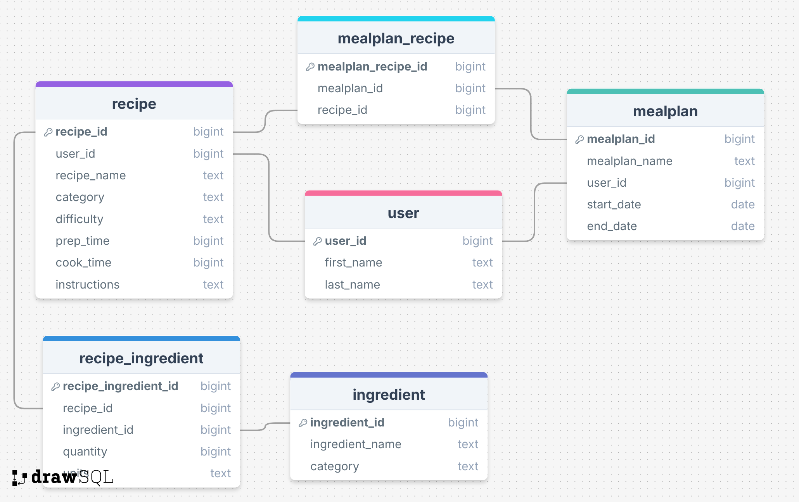

# Meal Plan

My project models data used to make and build meal plans. It includes information about the recipes in a meal plan, their ingredients, and the person who created the recipe/meal plan.



## Query I thought it did well on

**Question**: Which recipes fall under the 'Easy' difficulty category?

**GPT SQL Response**:

```sql
SELECT recipe_name
FROM recipe
WHERE difficulty = 'Easy';
```

**Friendly Response**: Sure! Here are some easy recipes: Spaghetti Bolognese, Vegetable Stir Fry, Greek Salad, Banana Pancakes, Ice Cream, Pizza, Fruit Salad, Caesar Salad, and Frog Eye Salad.

## Question that it tripped up on

I don't think this is totally fair to blame this completely on ChatGPT for missing this one. I was unfair in my question by asking it to find specific requirements for a meal plan without prompting it as to which meal plan I wanted. In the sql it provided, it left a comment to replace a var with the specific mealplan_id which is why it never got a good result in the first place.

Question: What are the total quantities of each ingredient required for a specific meal plan?

**GPT SQL Response**:

```sql
SELECT i.ingredient_name, SUM(ri.quantity) AS total_quantity, ri.units
FROM mealplan mp
JOIN mealplanrecipe mpr ON mp.mealplan_id = mpr.mealplan_id
JOIN recipe r ON mpr.recipe_id = r.recipe_id
JOIN recipeingredient ri ON r.recipe_id = ri.recipe_id
JOIN ingredient i ON ri.ingredient_id = i.ingredient_id
WHERE mp.mealplan_id = ? -- Replace with specific mealplan_id
GROUP BY i.ingredient_id, ri.units;
```

SQL Result is just [('Ground Beef',), ('Vegetables',)]

**Friendly response**: Ingredients used in multiple recipes include ground beef and vegetables.

The response didn't mention anything about quantities. To be fair though, it did find ingredients that were used in multiple recipes which is pretty similar train of thought though.

I think I could probably get the answer I'm looking for by telling it in the initial prompt which meal plan I specifically wanted to get the total quantities of ingredients for.

## Multi-shot

The multi shot approach unfortunately did not improve on the results from the previous question. I wanted the AI to randomly pick a meal plan without being prompted as to which specific meal plan I want information about.

**Question (multi-shot)**: What are the total quantities of each ingredient required for a specific meal plan?

SQL Result is just [('Ground Beef',), ('Vegetables',)]

**Friendly response**: Ground beef and vegetables.

## Conclusion

Both strategies performed well for straight forward queries involving single table questions or simple joins. The single-domain double-shot strategy was slightly better on some of the complex questions, but not much better on most. It would probably perform even better if there were more refinement in the prompts. It was more reliable for queries where it was helpful to have more context.
